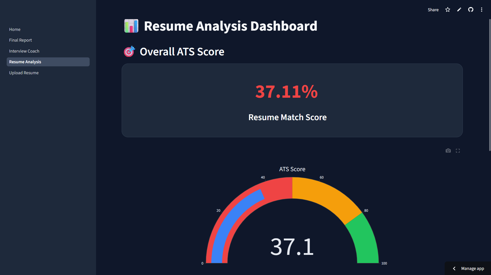
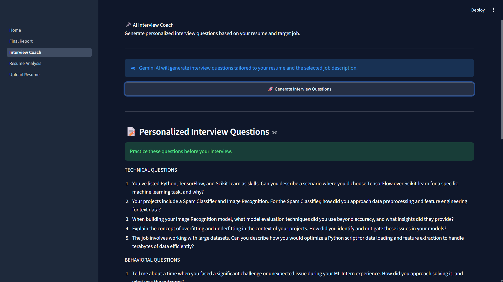

# 🤖 AI Resume Analyzer & Interview Coach

An AI-powered web application that evaluates resumes using **ATS scoring**, **semantic similarity**, and **Google Gemini AI** to help job seekers optimize their resumes, prepare for interviews, and build personalized learning roadmaps.

## 🌐 Live Demo

**Live Application:** https://ai-resume-analyzer-interview-coach-y394mvepqqpxgothhvjal2.streamlit.app/

## ✨ Key Features

* 📄 Upload Resume (PDF)
* 💼 Analyze against any Job Description
* 📊 ATS Compatibility Score
* 🤖 AI-powered Resume Review
* 🎯 Missing Skills Detection
* 🎤 Personalized Interview Questions
* 📚 Learning Roadmap Generation
* 📑 Professional PDF Report
* 📈 Interactive Analytics Dashboard

---

## 📸 Project Preview

*(Screenshots are shown below in this README.)*


## 🚀 Features

- 📄 Upload Resume (PDF)
- 📝 Paste Job Description
- 📑 Extract Resume Text
- 🎯 ATS Score Calculation
- 🧠 Semantic Resume Matching using Sentence Transformers
- 🤖 AI Resume Analysis using Gemini
- 💡 Missing Skills Detection
- ⭐ Strengths & Weaknesses Analysis
- 🎤 Technical Interview Questions
- 🗣 Behavioral Interview Questions
- 🛣 Personalized Learning Roadmap
- 📥 Downloadable PDF Report
- 📊 Interactive Dashboard with Plotly
- 🎨 Modern Streamlit UI

---

# 🛠 Tech Stack

## Frontend
- Streamlit

## Backend
- Python 3.11+

## Artificial Intelligence
- Google Gemini API

## NLP
- Sentence Transformers
- Scikit-learn

## PDF Processing
- PyMuPDF
- ReportLab

## Visualization
- Plotly

## Data Handling
- Pandas

## Deployment
- Streamlit Community Cloud

## Version Control
- Git & GitHub

---

# 📂 Project Structure

```text
resume-analyzer/

│── app.py
│── requirements.txt
│── README.md
│── .env

├── pages/
│   ├── upload.py
│   ├── analysis.py
│   ├── interview.py
│   └── report.py

├── utils/
│   ├── pdf_parser.py
│   ├── embeddings.py
│   ├── ats_score.py
│   ├── prompts.py
│   ├── gemini_client.py
│   └── report_generator.py

├── assets/

├── tests/

└── sample_data/
```

---

# ⚙️ Installation Guide

Follow these steps to run the project locally:

## 1️⃣ Clone the repository

```bash
git clone https://github.com/your-username/resume-analyzer.git
cd resume-analyzer
```

---

## 2️⃣ Create virtual environment

```bash
python -m venv venv
```

---

## 3️⃣ Activate virtual environment

### Windows:
```bash
venv\Scripts\activate
```

### Mac/Linux:
```bash
source venv/bin/activate
```

---

## 4️⃣ Install dependencies

```bash
pip install -r requirements.txt
```

---

## 5️⃣ Setup environment variables

Create a `.env` file in the root directory:

```bash
GEMINI_API_KEY=your_api_key_here
```

---

## 6️⃣ Run the application

```bash
streamlit run app.py
```

---

## 🎉 Done!

Open your browser at:

```
http://localhost:8501
```

---

# 📖 Usage

Once the application is running, follow these steps:

### Step 1: Upload Resume
- Upload your resume in PDF format.
- The application extracts and processes the resume text.

### Step 2: Paste Job Description
- Copy and paste the desired job description.
- The system compares your resume with the job requirements.

### Step 3: Resume Analysis
The application will:
- Calculate ATS Score
- Perform semantic similarity analysis
- Highlight strengths
- Identify missing skills
- Suggest resume improvements

### Step 4: Interview Preparation
Generate:
- Technical Interview Questions
- Behavioral Interview Questions
- Personalized interview preparation based on your resume.

### Step 5: Learning Roadmap
Receive a personalized roadmap highlighting:
- Skills to learn
- Recommended technologies
- Suggested learning timeline

### Step 6: Download Report
Generate and download a PDF report containing:
- ATS Score
- Skill Analysis
- Recommendations
- Interview Questions
- Learning Roadmap

---

# 🔄 Application Workflow

```text
          Upload Resume (PDF)
                   │
                   ▼
         Extract Resume Text
                   │
                   ▼
       Paste Job Description
                   │
                   ▼
      Semantic Similarity Analysis
                   │
                   ▼
          ATS Score Calculation
                   │
                   ▼
          Gemini AI Analysis
          ├── Missing Skills
          ├── Strengths
          ├── Weaknesses
          ├── Interview Questions
          └── Learning Roadmap
                   │
                   ▼
         Generate PDF Report
```

---

# 🏗 System Architecture

```text
                    USER
                     │
                     ▼
          Streamlit Web Interface
                     │
      ┌──────────────┼──────────────┐
      │              │              │
      ▼              ▼              ▼
 Resume Upload   Job Description   Dashboard
      │              │              │
      └──────────────┼──────────────┘
                     ▼
             PDF Text Extraction
              (PyMuPDF Parser)
                     │
                     ▼
            Resume Text Cleaning
                     │
                     ▼
        Sentence Transformer Model
          (all-MiniLM-L6-v2)
                     │
                     ▼
          Cosine Similarity Engine
                     │
                     ▼
              ATS Score Engine
      ┌──────────────┼──────────────┐
      ▼              ▼              ▼
 Skill Match   Keyword Match   Experience
                     │
                     ▼
             Gemini AI (LLM)
      ┌──────────────┼──────────────┐
      ▼              ▼              ▼
 Missing Skills   Interview Qs   Learning Roadmap
                     │
                     ▼
           PDF Report Generator
              (ReportLab)
                     │
                     ▼
            Download Final Report
```

---

# 🤖 AI Processing Pipeline

```text
Resume PDF
     │
     ▼
Extract Text
     │
     ▼
Clean Text
     │
     ▼
Create Embeddings
     │
     ▼
Compare with Job Description
     │
     ▼
Generate ATS Score
     │
     ▼
Gemini AI Analysis
     │
     ├── Strengths
     ├── Weaknesses
     ├── Missing Skills
     ├── Interview Questions
     └── Learning Roadmap
     │
     ▼
Generate Final PDF Report
```

---

# 📸 Application Screenshots

> **Note:** Screenshots will be updated after the final UI enhancement phase.

## 🏠 Home Page


---

## 📤 Resume Upload


---

## 📊 ATS Analysis Dashboard



---

## 🎤 Interview Coach



---

## 📑 Final Report


---

# ☁️ Deployment

This application can be deployed easily using **Streamlit Community Cloud**.

## Step 1: Push the Project to GitHub

```bash
git init
git add .
git commit -m "Initial project commit"
git branch -M main
git remote add origin https://github.com/your-username/resume-analyzer.git
git push -u origin main
```

---

## Step 2: Login to Streamlit Cloud

Visit:

https://share.streamlit.io

Sign in using your GitHub account.

---

## Step 3: Deploy

1. Click **New App**
2. Select your GitHub repository
3. Choose:

```
Main file:
app.py
```

4. Click **Deploy**

---

## Step 4: Configure Secrets

In **App Settings → Secrets**, add:

```toml
GEMINI_API_KEY="your_api_key"
```

---

## Step 5: Access Your Application

After deployment, Streamlit will generate a public URL:

```
https://ai-resume-analyzer-interview-coach-y394mvepqqpxgothhvjal2.streamlit.app/
```

---

# 🚀 Deployment Workflow

```text
Local Development
        │
        ▼
VS Code
        │
        ▼
Git Commit
        │
        ▼
GitHub Repository
        │
        ▼
Streamlit Community Cloud
        │
        ▼
Configure Secrets
        │
        ▼
Live Web Application
```

---

# 🔮 Future Improvements

The following enhancements are planned for future versions of the project:

- 🔐 User Authentication (Login & Signup)
- 📂 Resume History & Previous Analyses
- 📄 AI-Powered Resume Rewriting
- 🌍 Multi-language Resume Support
- 📈 Resume Progress Tracking Dashboard
- 💬 AI Chat Assistant for Career Guidance
- 🎯 Personalized Job Recommendations
- 📧 Email Report Sharing
- ☁️ Cloud Database Integration
- 📱 Mobile Responsive UI
- 🎨 Enhanced Professional Dashboard
- 📊 Advanced ATS Analytics
- ⚡ Migration to the latest Google GenAI SDK
- 📑 Premium PDF Report Design
- 🤖 Smarter Prompt Engineering for Personalized Recommendations

---

# 👩‍💻 Author

Isha Manoria

Aspiring AI & Data Science Engineer

- 📧 Email: ishamanoria@gmail.com
- 💼 LinkedIn: https://www.linkedin.com/in/ishamanoria/
- 🐙 GitHub: https://github.com/ishamanoria-2106

---

# 📜 License

This project is licensed under the **MIT License**.

You are free to use, modify, and distribute this project with proper attribution.

---

# 🙏 Acknowledgements

Special thanks to the open-source community and the creators of the following technologies:

- Python
- Streamlit
- Google Gemini API
- Sentence Transformers
- Scikit-learn
- PyMuPDF
- ReportLab
- Plotly

---

⭐ If you found this project useful, consider giving it a star on GitHub!